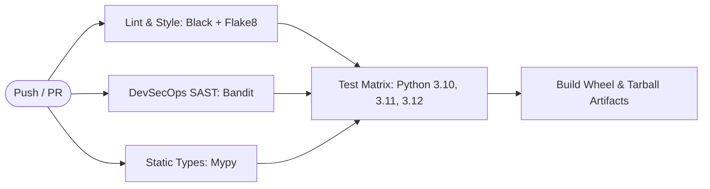

# Vision Builder Core (`vision-builder-core`)

[](https://github.com/DaldenU/vision-builder-core/actions/workflows/ci.yml)
[](https://www.python.org/)
[](https://github.com/psf/black)
[](https://mypy-lang.org/)
[](https://github.com/PyCQA/bandit)
[](https://github.com/DaldenU/vision-builder-core)
[](LICENSE)

> **Scientific edge-computing engine, computer vision preprocessor, defect detection pipeline, real-time telemetry tracker, and LLM incident prompt generator for the Vision Builder CV-Ops platform.**

---

## 1. Project Overview

**Vision Builder Core** serves as the scientific computational foundation for **Vision Builder**—an enterprise CV-Ops platform engineered to bridge Computer Vision (CV) edge models and Large Language Models (LLMs). 

Developed as part of the *Master's in Computer Science & Software Engineering (CSE-2507M)* curriculum at *Astana IT University* by **Andasov Temirlan** (Team: *Vision*), this module realizes the core requirements defined across Project Management Milestones:
1. **Assignment 1**: Project Charter, WBS, and Financial Justification.
2. **Assignment 2**: Agile (Scrum) methodology and Edge-to-Cloud Microservices architecture.
3. **Assignment 3**: Software Development, Automated Quality Assurance, and CI/CD Integration.

### High-Level Architecture

```
+-----------------------------------------------------------------------------------------+
|                                    VISION BUILDER CORE                                  |
+-----------------------------------------------------------------------------------------+
|                                                                                         |
|  [Raw Video Stream]                                                                     |
|          │                                                                              |
|          ▼                                                                              |
|  ┌─────────────────────────┐      Letterboxing, Standardize,                            |
|  │    ImagePreprocessor    │ ───► Color Transform, Resizing                             |
|  └───────────┬─────────────┘      (Vectorized NumPy / OpenCV)                           |
|              │                                                                          |
|              ▼                                                                          |
|  ┌─────────────────────────┐      Gaussian Noise Filter, Canny Edge Analysis,           |
|  │     DefectDetector      │ ───► Morphological Contouring, Anomaly Scoring             |
|  └───────────┬─────────────┘      (BoundingBox, DefectSeverity, Salience Ratio)         |
|              │                                                                          |
|       ┌──────┴──────────────────────────┐                                               |
|       │                                 │                                               |
|       ▼                                 ▼                                               |
|  ┌─────────────────────────┐      ┌─────────────────────────┐                           |
|  │    TelemetryTracker     │      │  IncidentReportBuilder  │                           |
|  │  • Rolling Latency (p95)│      │  • Automated Urgency    │                           |
|  │  • Throughput (FPS)     │      │  • Root Cause Synthesizer│                          |
|  │  • Defect Rate (%)      │      │  • Upstream LLM Prompt  │                           |
|  └─────────────────────────┘      └────────────┬────────────┘                           |
|                                                │                                        |
|                                                ▼                                        |
|                                  [JSON Context -> Upstream LLM]                         |
+-----------------------------------------------------------------------------------------+
```

---

## 2. Key Scientific Features

- **Vectorized Image Preprocessing**: Supports standardized RGB/Grayscale/RGBA conversions, aspect-ratio letterbox padding, min-max normalization, and ImageNet standardization for ONNX/PyTorch compatibility.
- **Scientific Anomaly Detection**: Edge-optimized visual defect identification with deterministic morphological analysis, adaptive contour localization, bounding-box IoU computation, and multi-tier severity classification (`LOW`, `MEDIUM`, `HIGH`, `CRITICAL`).
- **Thread-Safe Operational Telemetry**: Computes sliding-window percentiles ($P_{50}$, $P_{95}$ latency), throughput ($FPS$), and continuous defect frequency distributions to ensure industrial SLA compliance.
- **LLM Prompt Context Generator**: Synthesizes mathematical vision output and operational telemetry into structured payloads for automated LLM incident analysis and operator alerts.
- **CLI Benchmarking Utility**: Headless benchmark tool for stress-testing frame throughput and simulating synthetic defect injection.

---

## 3. Technology Stack Justification

| Technology | Role | Justification |
| :--- | :--- | :--- |
| **Python 3.10–3.12** | Core Runtime | Industry-standard language for scientific AI/CV systems; rich ecosystem; multi-platform execution. |
| **NumPy & OpenCV** | Computer Vision & Tensor Math | Highly optimized C/C++ native bindings for sub-millisecond edge frame processing without cloud latency. |
| **Pydantic v2** | Data Schemas & Validation | Strict type guarantees, high performance Rust-based serialization, and seamless JSON/API contract generation. |
| **Pytest & Pytest-Cov** | Automated Testing | Comprehensive unit and integration testing; ensures reproducibility and mathematical accuracy. |
| **Black & Flake8** | Code Formatting & Linting | Strict PEP 8 enforcement, deterministic formatting, and zero styling discrepancies across team members. |
| **Mypy** | Static Typing | Eliminates dynamic typing bugs and enforces static contract verification across all modules. |
| **Bandit** | DevSecOps Security Audit | Static Application Security Testing (SAST) scanning to prevent vulnerabilities in enterprise deployments. |
| **GitHub Actions** | CI/CD Automation | Cloud-native multi-version matrix build, automated testing, and distribution packaging. |

---

## 4. Installation

### From Source (Development Mode)
```bash
# Clone the repository
git clone https://github.com/DaldenU/vision-builder-core.git
cd vision-builder-core

# Create a virtual environment
python -m venv .venv

# Activate virtual environment
# Windows:
.venv\Scripts\activate
# Linux/macOS:
source .venv/bin/activate

# Install in editable mode with development dependencies
pip install --upgrade pip
pip install -e .[dev]
```

---

## 5. Quickstart Guide

### 5.1 Preprocessing and Defect Detection
```python
import numpy as np
from vision_builder import ImagePreprocessor, PreprocessingConfig, DefectDetector, DetectorConfig

# 1. Initialize preprocessor and detector
preprocessor = ImagePreprocessor(PreprocessingConfig(target_width=640, target_height=640))
detector = DefectDetector(DetectorConfig(confidence_threshold=0.5))

# 2. Ingest camera frame
frame = np.full((480, 640, 3), 200, dtype=np.uint8)
frame[200:240, 300:380] = 20  # Surface crack anomaly

# 3. Process and inspect
tensor = preprocessor.process(frame)
result = detector.detect(frame, frame_id="station_01_frame_42")

print(f"Status: {result.status}")
print(f"Defects Found: {len(result.defects)}")
for defect in result.defects:
    print(f" - Label: {defect.label}, Severity: {defect.severity}, Confidence: {defect.confidence}")
```

### 5.2 Real-Time Telemetry and LLM Prompt Generation
```python
from vision_builder import TelemetryTracker, IncidentReportBuilder

telemetry = TelemetryTracker()
telemetry.record_result(result)

metrics = telemetry.get_metrics()
print(f"Average Latency: {metrics.avg_latency_ms} ms | Throughput: {metrics.throughput_fps} FPS")

# Synthesize LLM prompt context for upstream supervisor alert
report_builder = IncidentReportBuilder(facility_zone="Assembly_Line_Alpha")
report = report_builder.build_report(result, telemetry=metrics)

print(f"Urgency: {report.urgency}")
print(f"Recommended Actions: {report.recommended_actions}")
print(f"LLM Context Payload:\n{report.llm_prompt_context['system_instruction']}")
```

---

## 6. Command Line Interface (CLI)

The package provides the `vision-builder` command line tool:

```bash
# Display CLI version
vision-builder --version

# Run headless performance benchmark on 100 simulated frames
vision-builder benchmark --iterations 100 --defect-rate 0.15

# Generate a sample LLM incident prompt JSON
vision-builder sample-report --output incident_prompt.json
```

---

## 7. Testing & Quality Assurance

The test suite achieves **96% code coverage** and validates all mathematical transformations, edge cases, bounding box geometry, and multi-threaded telemetry tracking.

Run the test suite locally:
```bash
# Run pytest with coverage metrics
pytest --cov=vision_builder --cov-report=term-missing

# Run code style formatting check
black --check vision_builder tests

# Run linter
flake8 vision_builder tests --max-line-length=88 --extend-ignore=E203,W503

# Run static type verification
mypy vision_builder tests

# Run security vulnerability scan
bandit -r vision_builder -ll
```

---

## 8. Continuous Integration & Delivery (CI/CD)

The GitHub Actions workflow is defined in [`.github/workflows/ci.yml`](.github/workflows/ci.yml). It executes automatically on all pushes and pull requests against `main`:



1. **Lint & Style**: Enforces PEP 8 style standards with Black and Flake8.
2. **Security Audit**: Scans for vulnerabilities via Bandit (answering Assignment 2's DevSecOps recommendation).
3. **Type Verification**: Verifies complete static typing compliance via Mypy.
4. **Multi-Version Test Matrix**: Executes test suite across Python 3.10, 3.11, and 3.12.
5. **Artifact Build & Packaging**: Builds reproducible `.tar.gz` and `.whl` distributions.

---

## 9. Academic Project Context

- **Institution**: Astana IT University
- **Program**: Master of Science in Computer Science & Software Engineering
- **Course**: Project Management (Year 2)
- **Course Code**: CSE-2507M
- **Student**: Andasov Temirlan (`255395@astanait.edu.kz`)
- **Team**: Vision
- **Project**: Vision Builder (CV-Ops Edge & LLM Integration Platform)

---

## 10. License

This project is licensed under the MIT License - see the [LICENSE](LICENSE) file for details.
